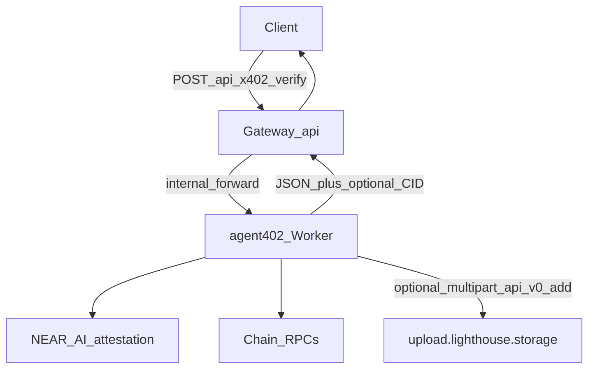

# Audit brief: Lighthouse IPFS receipts + x402 verify (YieldAgent / agent402)

**Purpose:** Single document for security / architecture review of the optional “pin settlement receipt to Lighthouse after successful x402 verify” feature, Cloudflare configuration, and why local `curl` to Lighthouse may fail while Workers may still succeed.

**Scope:** No secret values appear in this file. Operators hold `LIGHTHOUSE_API_KEY` in Cloudflare only.

**Operator verification (upload → CID → gateway):** see [`docs/LIGHTHOUSE_E2E_VERIFICATION.md`](./LIGHTHOUSE_E2E_VERIFICATION.md).

---

## 1. Was the Cloudflare Worker configured?

**Yes — for the `agent402` Worker** (custom domain `agent.yieldagentx402.app`).

- **Secret binding name:** `LIGHTHOUSE_API_KEY` (type `secret_text`).
- **Verification (operator / auditor):**

  ```bash
  cd /path/to/Baseline\ \#11
  npx wrangler secret list --config agent402-clean-deploy/wrangler.jsonc
  ```

  Expected: `LIGHTHOUSE_API_KEY` appears in the list (value is never shown).

- **Deploy source of truth:** [`agent402-clean-deploy/wrangler.jsonc`](../agent402-clean-deploy/wrangler.jsonc) — Worker name `agent402`, `main: worker.js`.
- **Production deploy order** (see [`deploy-all.sh`](../deploy-all.sh)): step 1 deploys `agent402-clean-deploy`; step 2 deploys `gateway-clean-deploy` (API `api.yieldagentx402.app`).

**Not stored in:** `wrangler.jsonc` `vars` (would leak in repo). Only `wrangler secret put`.

---

## 2. End-to-end data flow

1. Client → **Gateway** `POST https://api.yieldagentx402.app/api/x402/verify` (public; rate-limited).
2. Gateway proxies to **agent402** `POST /x402/verify` with internal auth headers (see gateway code).
3. agent402: replay protection → TEE gate → on-chain settlement → **if all succeed**, builds JSON response, then **best-effort** Lighthouse upload.
4. If Lighthouse returns a CID: response JSON includes `ipfsProofCid`, `ipfsProofUrl`, and **alias fields** `filecoinProofCid`, `filecoinProofUrl` (same values — content addressing; Lighthouse persists to Filecoin-backed storage). agent402 adds response headers `x-ipfs-proof-cid` and `x-filecoin-proof-cid`.
5. Gateway copies those proof headers on success when upstream body contains the CID fields; CORS exposes them for browser clients.



---

## 3. Code references (review these files)

| Component | Path | What to review |
|-----------|------|----------------|
| Upload + receipt shape + non-blocking behavior | [`agent402-clean-deploy/worker.js`](../agent402-clean-deploy/worker.js) | `uploadReceiptToLighthouse` (Lighthouse `upload.lighthouse.storage` → CID), `buildLighthouseReceipt`, `maybePinVerifyReceipt` (~L474–L570); sets `ipfsProof*` and alias `filecoinProof*`; response headers `x-ipfs-proof-cid`, `x-filecoin-proof-cid`; CORS exposes both |
| Secret documented (comment only) | [`agent402-clean-deploy/wrangler.jsonc`](../agent402-clean-deploy/wrangler.jsonc) | Comment block listing `LIGHTHOUSE_API_KEY` |
| Gateway proof headers + CORS | [`gateway-clean-deploy/src/index.js`](../gateway-clean-deploy/src/index.js) | `proofHeaders` / `x-ipfs-proof-cid` + `x-filecoin-proof-cid` (~L5069–L5077); `access-control-expose-headers` (~L7703) |
| `jsonWithVerificationBinding` extra headers | same file | Seventh argument passes through to `json()` |
| Landing copy | [`yieldagent-landing/worker.js`](../yieldagent-landing/worker.js) | “Immutable settlement receipt (IPFS / Lighthouse)” on `/verification`; apply page verify bullet |
| Operator test scripts | [`scripts/verify-x402-lighthouse.sh`](../scripts/verify-x402-lighthouse.sh), [`scripts/set-lighthouse-secret.sh`](../scripts/set-lighthouse-secret.sh) | Optional; not in request hot path |

**Mirror note:** [`yieldagent-api-gateway/src/index.js`](../yieldagent-api-gateway/src/index.js) may match gateway-clean-deploy for the same proxy/CORS behavior; **production API deploy uses `gateway-clean-deploy`** per `deploy-all.sh`.

---

## 4. Security / assurance properties

- **Fail-open on storage:** If `LIGHTHOUSE_API_KEY` is unset, or Lighthouse `fetch` fails, or upload returns non-OK, **verify still returns success** for an otherwise valid payment (no `ipfsProof*` / `filecoinProof*` fields). Pinning must not block payments.
- **Receipt content:** Trimmed JSON (`yieldagent-x402-receipt-v1`): rail, chain, tx hash, digest, settlement flags, **short TEE summary** (prefix of mr hash), not necessarily full raw attestation. Max size guard before upload.
- **Upload timeout:** `AbortSignal.timeout(12000)` on Lighthouse `fetch`.
- **Auth to Lighthouse:** `POST https://upload.lighthouse.storage/api/v0/add` with `Authorization: Bearer <LIGHTHOUSE_API_KEY>` and **multipart** `file` (JSON receipt as `yieldagent-x402-receipt.json`), matching Lighthouse’s documented curl. Do not set `Content-Type` manually (boundary is set by `FormData`).
- **SDK:** Official docs also show `lighthouse.uploadText()` via `@lighthouse-web3/sdk`; this Worker uses **raw `fetch` + `FormData`** to avoid bundling the SDK (Node/fs-heavy dependencies ill-suited to Workers).
- **Key handling:** Key only in Cloudflare Worker secret; never committed to git in this design.

---

## 5. Why `curl` from a laptop can show `Connection timed out` (28)

- **Symptom:** `curl: (28) Failed to connect to … port 443 … Couldn't connect to server` when probing Lighthouse upload or legacy hosts from **your** network.
- **Meaning:** TCP/TLS from **that network** did not complete (VPN, ISP, firewall, regional routing). It is **not** proof that the Worker cannot reach `upload.lighthouse.storage` (egress path is Cloudflare → internet, different from home Wi‑Fi).
- **Invalid auth** would typically be **HTTP 401** *after* a connection is established.
- **Auditor recommendation:** Confirm with a successful `POST /x402/verify` that returns `ipfsProofCid`, or Cloudflare **Workers Logs** / trace for `fetch` to `upload.lighthouse.storage`, or test from a neutral VPS.

---

## 6. Shell mistake: `zsh: command not found: -H`

`-H` is a **curl flag**, not a standalone command. The entire request must be **one** command starting with `curl`, for example:

```bash
echo "{\"yieldagent\":\"manual-smoke\",\"ts\":\"$(date -u +%Y-%m-%dT%H:%M:%SZ)\"}" > /tmp/receipt.json
curl -sS --max-time 120 -X POST 'https://upload.lighthouse.storage/api/v0/add' \
  -H 'Authorization: Bearer YOUR_KEY_HERE' \
  -F 'file=@/tmp/receipt.json'
```

Do **not** wrap the token in `<` `>` unless those characters are literally part of the key (they are not).

---

## 7. Change log / provenance in repo

- [`CHANGES.md`](../CHANGES.md) — Lighthouse MVI, gateway mirror, ops note for secret + deploy version IDs (dates as recorded there).
- [`README.md`](../README.md) — short “hot/cold” accountability bullet under Provenance.

---

## 8. Suggested auditor checklist

- [ ] `wrangler secret list` shows `LIGHTHOUSE_API_KEY` for `agent402` (name only).
- [ ] Code review: `maybePinVerifyReceipt` cannot throw into verify success path; errors logged/warned only.
- [ ] Code review: receipt JSON excludes unnecessary PII; size bounded.
- [ ] Confirm production gateway is **`gateway-clean-deploy`** deployment, not only the duplicate `yieldagent-api-gateway` tree.
- [ ] If key was ever pasted in chat/tickets: **rotate** Lighthouse key, `wrangler secret put LIGHTHOUSE_API_KEY`, redeploy agent402.

---

**Document version:** 2026-04-07 (rev 2 — `upload.lighthouse.storage` multipart) · Baseline #11 canonical tree.
